# CNJS使用说明

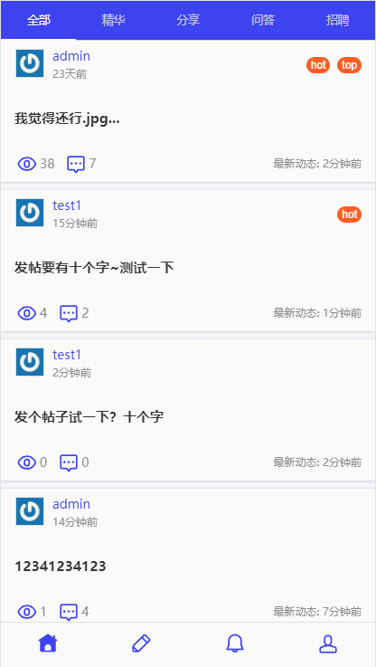

### 1.登录
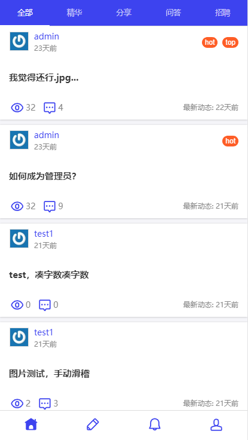

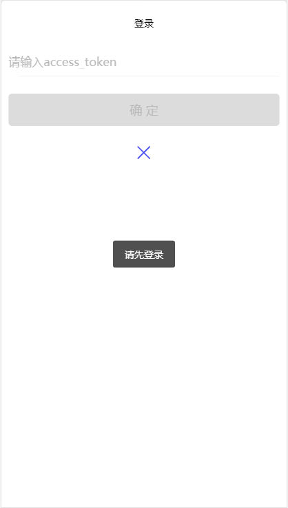

点击底栏除主页外的任意一个图标，即可打开登录页面。输入access token,点击确定以登录。

若不想登录，点击蓝色X符号即可退回主页。

### 2.浏览主题帖

浏览功能在未登录状态下也可以使用。

在首页点击帖子的标题，即可打开主题帖，查看其发布者，标题以及内容。其中，首页的顶栏可以对主题帖的分类进行筛选。

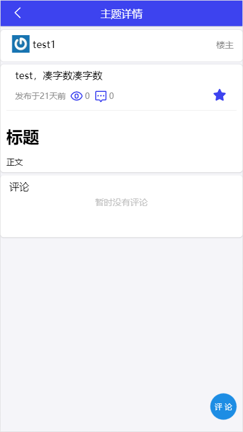

### 3.评论

评论功能需要登录后使用。

在主题帖页面，点击右下角评论，即可对主题帖进行评论。

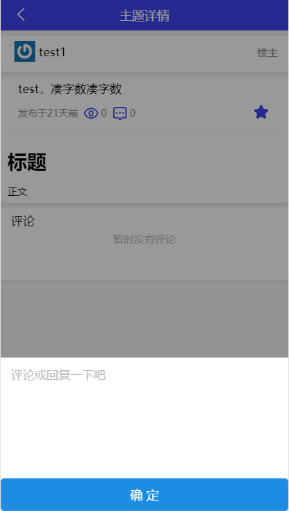

输入评论的内容，点击蓝色确定按钮即可对主题帖发布评论。

若不想评论，点击输入框上方的灰色区域即可关闭输入框。

### 4.回复

该功能需要登录后使用。

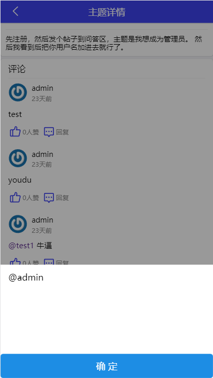

回复功能是对主题帖下的评论进行回复，点击评论下方的回复按钮，调出回复输入框，点击蓝色确定按钮即可发布对评论的回复。

若不想回复，点击输入框上方的灰色区域即可关闭输入框。

在”我“页面，点击”最近回复“，可查看自己回复过的主题帖。

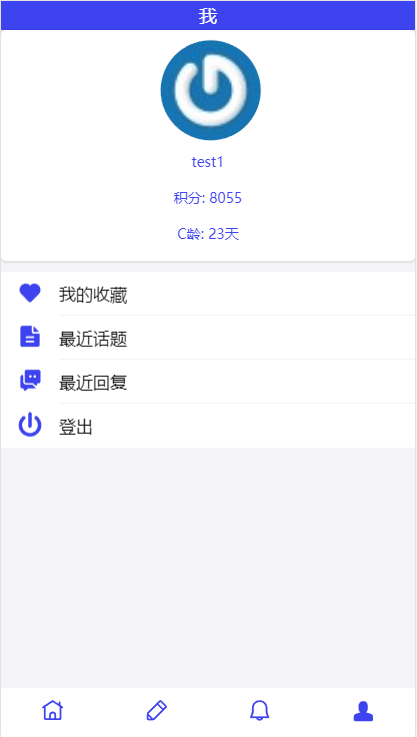

### 5.点赞

该功能需要登录后使用。

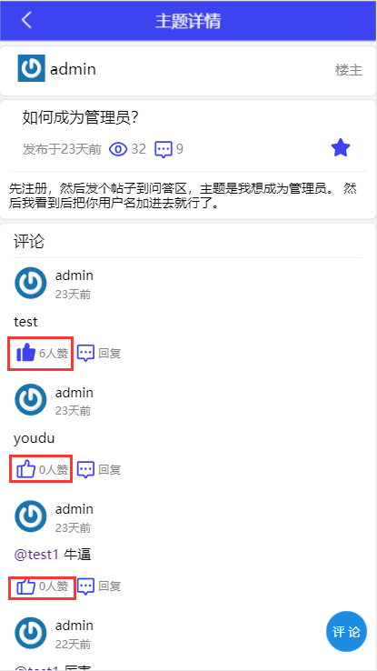

在主题帖页面下的评论中，点击评论下方的点赞按钮为评论点赞。点赞按钮变蓝表示已经对该内容点赞。对已点赞的内容再次点击点赞按钮，可取消点赞。

### 6.发帖

该功能需要登录后使用。

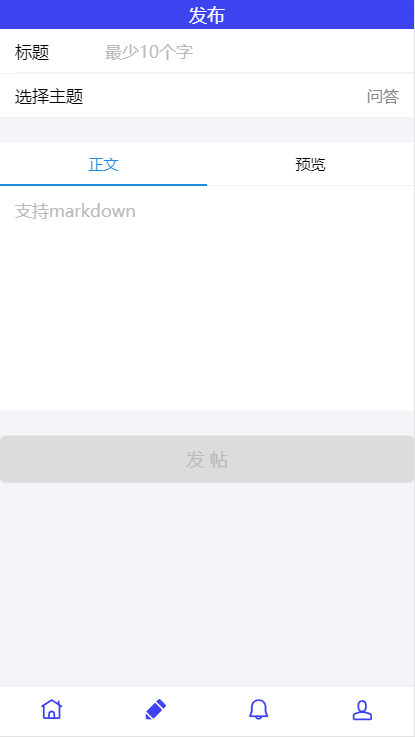

点击底栏的铅笔图标，可进入“发布”页面。在该页面输入标题、主题以及主题帖的内容后，点击发帖按钮可发布主题帖。正文支持markdown语法，点击“正文”右侧的”预览“，可预览渲染后的markdown文本。其中标题至少需要十个字符。

在”我“页面，点击”最近主题“，可查看自己发布的主题帖。

### 7.收藏

在主题帖页面，可对主题帖进行收藏。点击主题帖标题右侧的星形图标，会提示收藏成功。取消收藏再次点击即可。

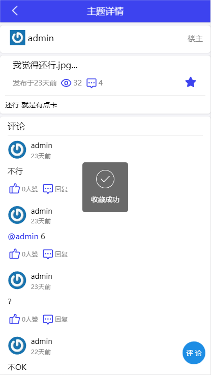

已收藏的帖子，在点击底栏人形图标后，可进入”我“页面。在”我“页面，点击”我的收藏“即可打开收藏列表。

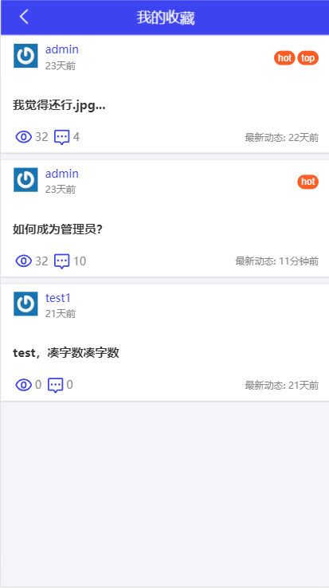

### 8.消息通知

在发布的主题帖有新评论/发布的评论有新回复/有人@自己时，消息页面会显示通知。点击底栏铃铛图标，即可打开消息页面查看。

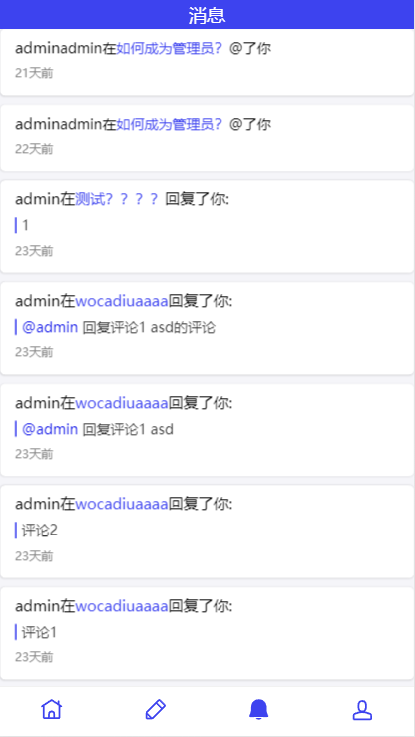

### 9.登出

 在”我“页面，点击”登出“按钮，即可注销自己的登录。

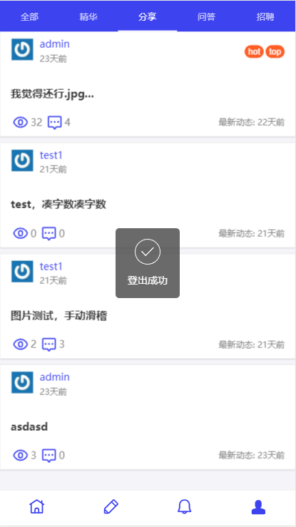

登出后会弹出提示，显示登出成功，同时自动退回主页。