# CNJS软件设计文档
## 架构设计
### 架构描述

整个APP的架构，分为前后端。前端的架构为MVVM架构，为模型层，视图层，视图模型层，为目前前端开发中最受欢迎的架构。 
后端采用RESTful设计风格，应用程序状态和功能可以分为各种资源。资源是一个有趣的概念实体，它向客户端公开。资源的例子有：应用程序对象、数据库记录、算法     等等。每个资源都使用 URI (Universal Resource Identifier) 得到一个唯一的地址。所有资源都共享统一的接口，以便在客户端和服务器之间传输状态。使用的      是标准的 HTTP 方法，比如 GET、PUT、POST 和 DELETE。Hypermedia 是应用程序状态的引擎，资源表示通过超链接互联。 
REST 约束条件作为一个整体应用时，将生成一个简单、可扩展、有效、安全、可靠的架构。由于它简便、轻量级以及通过 HTTP 直接传输数据的特性，用于 web 服务和动态 Web 应用程序的多层架构可以实现可重用性、简单性、可扩展性和组件可响应性的清晰分离。

#### 视图层
个人设置改成用户主页。
1. 首页
2. 发布页
3. 消息 
4. 用户主页

#### 视图模型层
这个是前端框架的一个实现。通过绑定试图模型层和视图层。当模型层的数据发生变化时，会让视图模型层也发生变化，同时视图层也会变化。

#### 视图模型层
这里是前端的数据存储的地方。来源是通过HTTP请求和后端交互，获取数据。

#### 数据层
后端主要是作为一个数据来源。通过接受到HTTP请求，然后根据不同的请求去操作数据库，并返回数据。

### 架构图
 

### 关键抽象
#### 用户模块
User（抽象类）， RegisterUser（已注册用户），AnonymousUser（游客） 

#### 主题模块
Topic(抽象类)，All(所有)，Best(精华)，Share(分享)，Ask(问答)，Job(招聘) 

#### 评论模块
Comments(抽象类），包含author_id 

#### 消息模块
Messages(抽象类），类型: reply（回复话题），reply2（话题中回复），follow（关注用户），at（ ＠某用户） 

## 用例分析
### 补充用例归约
经检查，本项目组发现用例归约比较完善，暂时无需补充。

### 用例中类的析取
#### 游客注册用例类的析取
游客首次使用该app时，只拥有帖子的浏览权限；在注册时，输入access-token后，注册成功，系统分配一个用户ID标识用户，加入用户数据库，获得用户权限。 
边界类：signin。signin.html为游客注册填写access-token的页面。 
控制类：export。export控制类负责处理注册时的相关操作，包括输入access-token；加入用户数据库，记录用户相关信息；完成注册反馈。 
实体类：user. user实体类表示注册时的信息，包括注册码（access-token），注册后的用户ID。 
 
 

用户在主页面点击我,系统调用边界类signin函数，再调用控制类中showup()显示登陆界面，signup()函数让用户登录，调用user实体类。成功后结果返回给控制类。 

下图是边界类signin的文件其中的登录，输入用户名部分。 
 

下图是控制类export文件中的登录操作：
 

下图是实体类user实体类注册时的信息，包括注册码（access-token），注册后的用户ID。
 

#### 用户发帖用例类的析取
经过登录的用户可以发帖，进入发布的界面在相关分类话题社区发帖，发布的有标题，日期，发帖人等信息并且有浏览数，点赞数，回复以及分享的数量信息反馈。 
边界类：edit。在edit.html下为登录用户发布帖子的界面。 
控制类：exports。exports控制类负责处理用户发布帖子时的相关操作，包括登录，进入发帖界面，发布帖子，发帖成功后反馈成功信息。 
实体类：topic. topic实体类表示发布的帖子中的相关信息，有标题，日期，发帖人等信息并且有浏览数，点赞数，回复以及分享的数量等信息反馈。 

用户发贴时，边界类的edit_topic()函数调用控制类exports.put()函数来对帖子进行编辑，包括标题，板块，内容。要求控制类能自动检查是否合法，发布成功的帖子存入实体类topic中并返回上一界面。 
下图为用户发布帖子的edit.html文件，进入主页后可编辑话题进入编辑界面，完成后可发布，反馈是否发布成功信息。 

下图是exports控制类的exports.put()操作，在界面点击创建新话题后控制类exports.put()调用。自动检查标题，内容是否合法。 

下图是topic实体类，表示发布的帖子中的相关信息，有标题，日期，发帖人等信息并且有浏览数，点赞数，回复以及分享的数量等信息反馈。 

#### 用户评论用例类的析取
在发帖下，用户可以进行评论。进入选择的帖子下，点击评论进入评论界面，完成后点击确认完成评论。评论完成后可以进行点赞，回复，置顶操作。 
边界类：reply。reply.html为在已发布话题下的回复界面。 
控制类：exports。exports控制的exports.add()操作负责在创建回复时调用。用来在已发布的话题（即帖子）评论。 
实体类：Reply。 Reply实体类表示在发布的帖子下的评论，以表格形式存储在数据库中。 
 

用户评论时，点击评论，边界类类reply调用reply_topic()进入编辑界面，控制类调用exports.add()编辑评论，完成后调用exports.update()更新实体类Reply数据，最后返回上一级。 

下图是用户评论时的界面，点击评论进入到此页面。 

下图是控制类exports.add()操作。exports.add()负责在创建回复时调用，用来在已发布的话题（即帖子）评论，且检查内容输入是否为空。 

下图是实体类Reply，表示在发布的帖子下的评论，以表格形式存储在数据库中。 

#### 收藏帖子用例类的析取
已注册用户在登录后，拥有收藏帖子的权限。 
边界类：collect_topics。在collect_topics.html下为登录用户收藏帖子的界面。 
控制类：exports。exports控制类负责处理用户收藏帖子的操作。 
实体类：topic_collect。topic_collect实体类表示收藏的帖子，包括收藏的日期、主题以及用户ID。 
 
 

下图为用户收藏帖子的界面，可以展示收藏的话题以及对没有收藏的帖子错误反馈。 

下图为控制类exports。exports.toggleStar()操作负责处理用户收藏帖子。再进行收藏操作时，该朝着被调用，对实体类topic_collect进行调用增加实例。 

下图为实体类topic_collect，topic_collect实体类表示收藏的帖子，包括收藏的日期、主题以及用户ID。 

### 分析机制
安全：将用户的相关信息进行加密保存到数据库中。 
持久化：将系统的数据保存到数据库中，实现数据的持久化。 
接口：系统的设计为了能够保障系统的鲁棒性，需要实现高内聚，低耦合的设计原则，通过接口，将不同板块、子系统的逻辑进行解耦。对于一个子系统的访问需要通过访问该系统的外部类（接口的实现）

### 合并分析类

所有用户均为User的子类，不同用户具有不同的权限。论坛用户包括游客和已注册登陆的用户，其中游客只可以进行注册和浏览帖子的操作；已登录用户可以在游客权限的基础上还可以在对应的分类区发布帖子，对感兴趣的帖子进行回复，对认为有用的回复进行点赞回复互动，收藏帖子并可以查看收藏的帖子，浏览最近看过的话题以及最近的回复，可以收到回复的消息。 

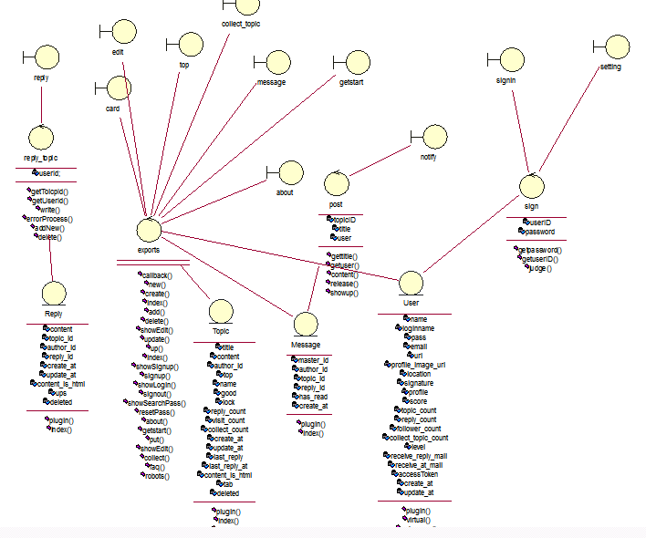

## 子系统及其接口设计

### 确定设计类

根据上一部分的分析，考虑各部分之间的逻辑关联，并将各部分内容具体化，可得到下面的总体类设计图： 

 

通过各个类的属性，根据各部分之间的逻辑关联，便可设计出各个类的接口函数，以下分别是用户类、主题帖子类、回复类、收藏类、消息提醒类的详细类图： 

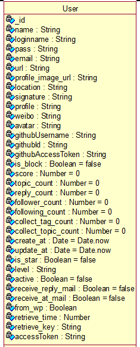 
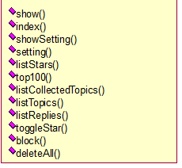 
*用户类类图* 

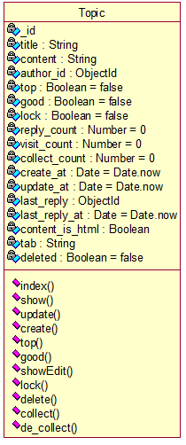 
*主题帖子类图*

 
*主题帖子回复类类图* 

 
*主题收藏类类图* 

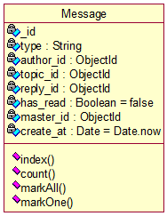 
*主消息提醒类类图* 

### 子系统划分

们采用了表现层状态转换（Representational State Transfer，REST）的设计思想，即 
（1）每一个URI代表一种资源； 
（2）客户端和服务器之间，传递这种资源的某种表现层； 
（3）客户端通过四个HTTP动词，对服务器端资源进行操作，实现"表现层状态转化"。 
通过RESTful API的设计，实现前后端完全分离，故而可分为两部分： 
- 前端交互子系统
- 后端服务子系统。

### 前端交互子系统
前端交互子系统遵循MVVM设计模式。 由V(视图层)，VM层(控制层)，和M(数据层)组成。V层是展示部分，M层数据通过接口从后端获取。VM层是将V层和M层绑在一起。M层数据影响V层的展示。V层的交互修改M层的数据。我们网站可以将交互分为以下几个部分：登录部分，主页部分，主题详情页部分，消息页部分，用户详情页部分，管理员部分。 

(1)登录部分 
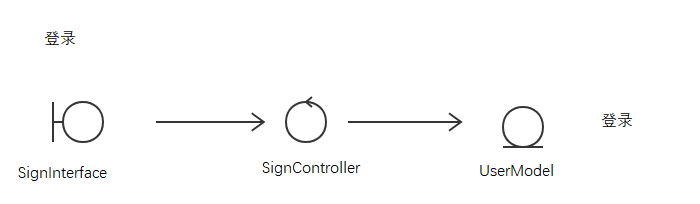

(2)主页部分 
主题的获取
  

(3)主题详情页部分 
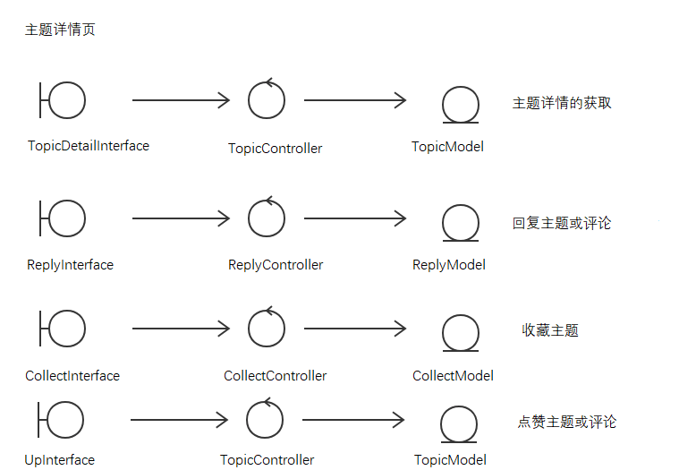

(4)消息页部分 
查看未读的通知、评论，快速回复，标记已读  

(5)用户详情页面  
用户基本信息、用户活近期活动，参与的话题与评论  
  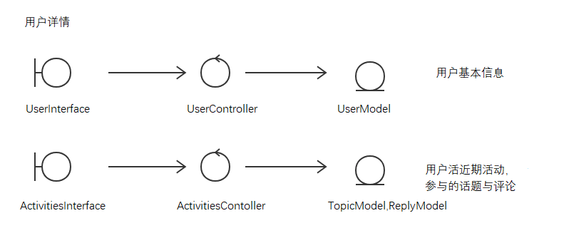
  
(6)管理员页面  
管理员特权功能，禁言，达人设置
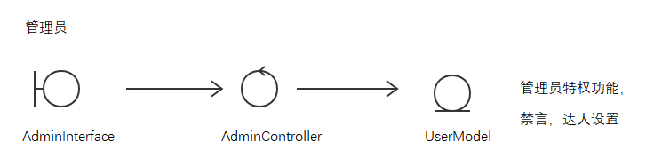

### 后端服务子系统及其接口设计  

后端服务子系统遵循MVC设计模式，其中视图层部分主要展现逻辑已经分离到前端，后端主要提供静态资源传输服务。此外，根据网站的各个功能模块划分，可以将其分为以下几个部分：账户安全控制部分，用户控制部分，消息统治控制部分，文章主题控制部分，评论回复控制部分，主题收藏控制部分。  

静态资源服务部分  
上传图片或附件，其它静态资源，以及网站首页传输。    
 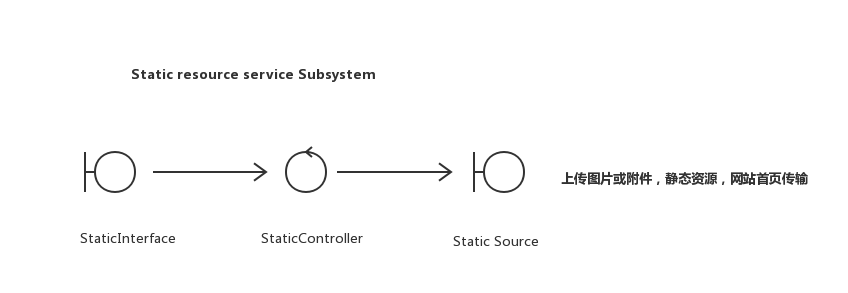 
  
  
（1）账户安全控制部分  
  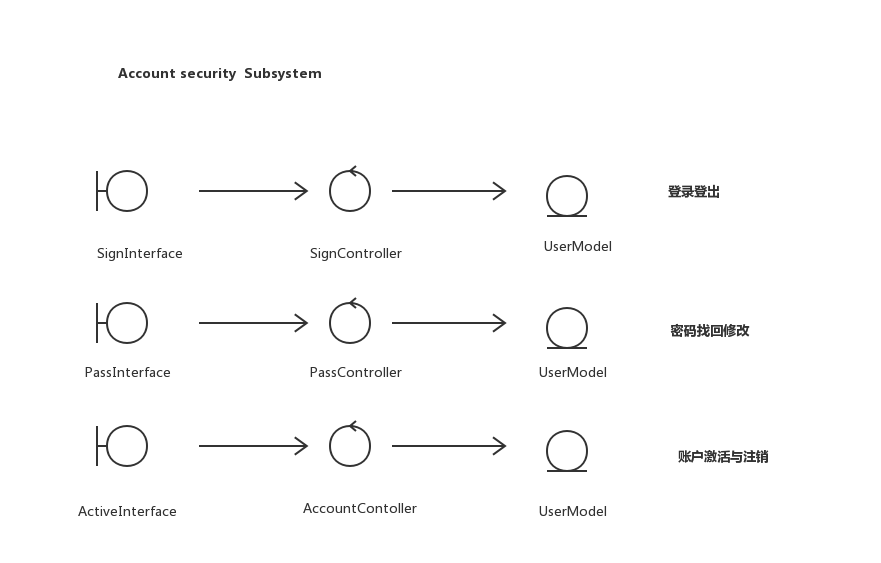  
 
（2）用户控制部分  
这部分主要是用户主页的各种内容，而非账户信息。  
 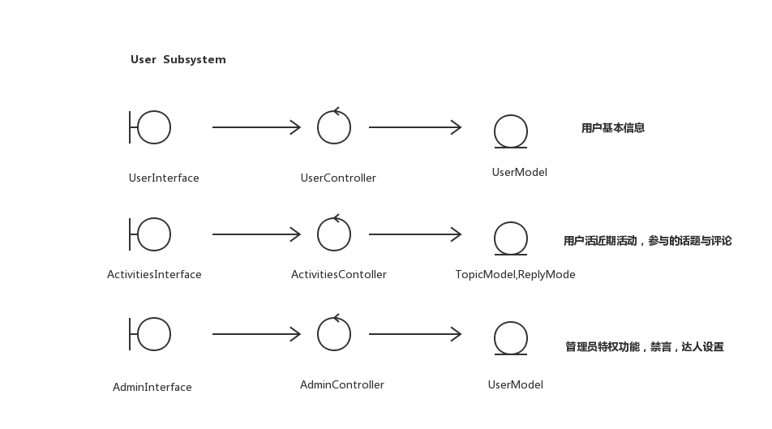  

（3）消息统治控制部分  
查看未读的通知、评论，快速回复，标记已读  
  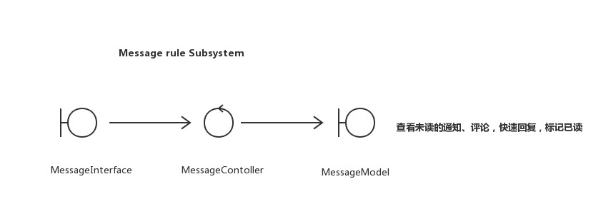  
  
（4）文章主题控制部分  
新建，修改话题文章，加精，置顶，锁定，关注，删除等  
 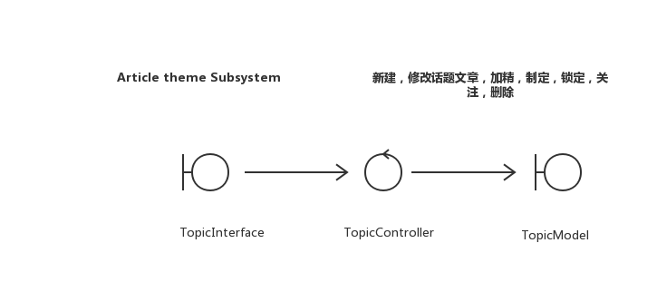  

（5）评论回复控制部分  
新建，修改，删除自己的评论  
  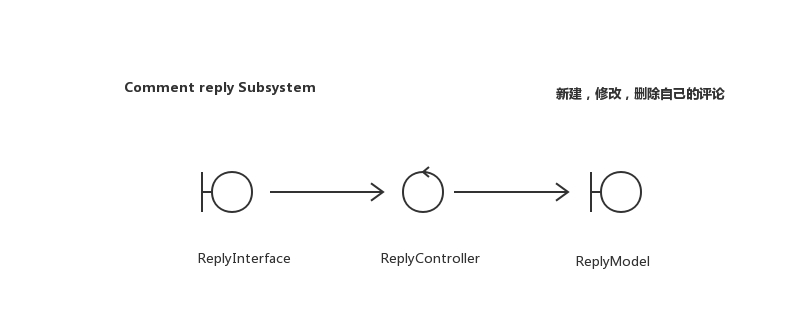  
  
  （6）主题收藏控制部分  
用户收藏内容  
 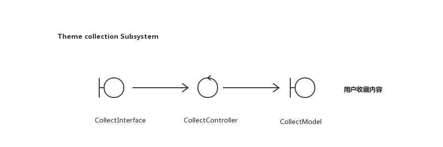
